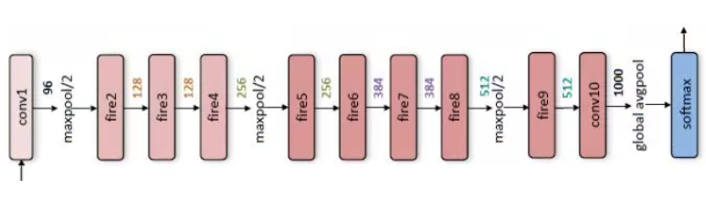

金山办公AI团队CV小组正在做的事情：

* 文档图像矫正(document dewarping)  不仅仅是透视矫正
* 文档图像边缘检测(document edge detection)  基于CNN的矩形框检测，移动端实现
* 文档自动分类(automatic document category classfication)  使用tensorflow lite实现了对文档图像进行分类
* 在线OCR(online OCR)    在服务器端使用tensorflow实现了角度矫正，文本线检测等
* 离线OCR(offline OCR)   使用tensorflow lite在移动设备端实现快速的文本定位
* 版面分析(layout analysis)  在将图像转化为文档的时候，使用基于tensorflow和scikit-learn的版面分析，大大减少工程的工作量

###### 文档图像矫正document dewarping

1. 功能描述：用手机拍一张文档图像，输入到软件中，可以将图像进行矫正并去除无用的背景。

2. 移动端+云端(服务器端)的图像文本矫正功能：在移动端进行图像边缘检测，在云端进行几何矫正。

   **（1）背景：**普通的文档矫正功原理：通过检测文档边缘或者四个角点，然后进行透视变换。然而弯曲矫正的计算量就太大了，不得不部署在计算集群上，将压缩和加密的原图以及相关参数通过网络传输到服务器端进行计算，然后将计算结果再次通过网络传递到移动端呈现。整个工作其实可以全部在云端完成，然而为了使用户获得更好的体验，能够直观地看到实时检测的文档区域，我们将文档检测部分放在了本地。

   ​		用户使用wps打开相机进行预览时，我们的深度学习模型就在后台进行运行，逐帧检测文档区域，并将检测结果渲染在屏幕上。

   **（2）移动端：** 移动端主要实现的是图像的边缘检测功能。使用tensorflow lite实现在移动端的实时文档图像边缘检测，使用基于CNN的深度学习模型进行检测。参考了SqueezeNet设计了一个7层的CNN，虽然和之前使用的开源的预训练模型相比精度有所下降，但是速度得到了大大提升，内存占用也有了明显下降，低端手机数帧每秒，高端手机每秒可达到30帧每秒。为了弥补由于检测不准导致的抖动问题，我们在网络外边加了滤波器，让检测结果在视觉上看起来更稳定。

   

   ​			边缘检测实现步骤：

   ​			**1. ** 使用tf.keras搭建深度神经网络实现边缘检测。在我们的图像扫描算法中，CNN边缘检测网络的参数大小约为5M。基础网络是SqueezeNet，7层。

   ​			**2.**  使用tf.keras中的fit_generator和tf.data来对数据进行预处理， 根据我们的业务需求对损失函数进行了修改；

   ​			**3.** 训练完成后，使用tfLiteConverter将模型转换为FlatBuffer格式并将其集成到我们的应用程序中。

   ​			***tensorflow lite的优点：*** 

   ​				（1）小尺寸。训练过的深度学习模型可以很容易的缩小尺寸并应用到移动平台上。内存占用也比较		小，因此对用户非常友好。

   ​				（2）跨平台支持。支持ios和android

   ​				（3）模型转换方便。使用tensorflow训练的模型可以很自然地转化为tensorflow lite模型。

   ​				（4）从tensorflow过渡过来很自然。tensorflow lite的架构设计和工作流程和tensorflow很相似，		而且tensorflow lite体积小，使用简单。

   ​				（5）社区资源丰富。

   **（3）服务端：** 实现文档的几何矫正。几何矫正需要大量的计算能力，目前仅在移动端进行几何矫正是不可行的，因此，我们将其部署到我们的高性能计算机集群上。我们压缩和加密原始图像，将这些图像传输到我们的服务器上进行扭曲矫正后再通过网络传回移动设备显示。

   ​	

   

   