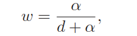
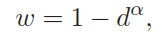

# DocUNet:基于堆栈U-Net的文档图像扭曲矫正

**摘要：**  （1）由于移动摄像头无处不在，拍摄文档图像来对物理文档进行数字化记录是一种普遍的方式。  （2） 为了使得文本检测更加容易，我们常常希望将一张弯曲的或者折叠的文档图像数字化地展平。 （3）本文中，我们首次提出了基于学习的方法来实现这个目标(将扭曲的图像转换为对应的平整的图像)。我们提出了带有“中间监督”的堆栈式UNet直接预测扭曲图像到矫正图像的正向映射。 （4）由于大规模具有真实形变的样本很难获得，我们通过对未扭曲的图像进行仿射的方式制作了一个约10万张合成图像的数据集。		   （5）本文的模型在这个训练集上训练并采用多种数据增强的方式来增强网络的泛化性能。 （6）制作了一个包含了各种真实世界条件的benchmark（130张各种场景的图像）。 （7）在制作的benchmark上进行定量和定性的评估实验，并和之前的非基于学习的方法进行对比。

**1、介绍**    	  文档数字化作为一种重要的保存现有印刷文档的方法，使得用户在任何地点任何时间都可获取这些文档。传统的，文档是使用平板扫描仪来进行数字化的，然而平板扫描仪是不可移动且昂贵的设备。近年来，随着移动摄像头越来越流行，拍摄实物文档图像已经成为最简单扫描文档的方式。一旦拍摄，图像可以进一步地被文本检测与识别的处理，以用于内容分析和信息提取。   	   实际中最常见的问题是当拍摄文档图像时，文档可能不在一个理想的扫描条件下：可能弯曲、折叠、褶皱或者背景特别复杂。想想一下从口袋里拿出皱巴巴的收据。这些原因都可能对自动文档图像分析流程的下游产生严重的问题。如图1所示。因此，对采集到的这种图像进行展平非常值得研究。 		以前已经有多种方法用于文档图像展平。有一些是经过精心的设计的校准过的硬件如：立体摄像机或者结构光来测量文档的3D形变。这些方法取得了高质量的结果，但是额外的硬件限制了他们的应用。其他的一些方法[28,36]通过利用多视图来重建变形文档的3D形状从而摆脱了硬件的限制。 其他方法目标是通过分析单张图像，使用多种手工低级特征如光照、阴影和文本行等来重建矫正文档。 		本文提出了一种新颖的基于学习的方法来重建自然世界中任意弯曲和折叠的文档图像。不像之前的方法，我们的方法是到首个端到端的基于学习直接预测文档图像变形的方法。之前的方法只是用学习的方式来提取特征，最终的图像重建仍然基于传统的优化流程。我们的方法基于CNNs来完成端到端的文档图像重建。与基于优化的方法相比，前馈神经网络在测试阶段非常的高效。此外，这个数据驱动的方法有很好的泛化性能，只有数据集中有相应的数据，就可以矫正各种类型的文档图像，如文本、图和手写等。 		我们将这个任务看作是寻找一个适当的2D图像扭曲，可以矫正形变的图像。我们的网络预测了一个映射场，可以将形变的源图像上的像素点映射到结果图像D中：D(x,y)=S(u,v) 		通过这个公式表示这个问题，我们发现这个任务和语义分割有一些共同之处。对于后者，网络对每个像素指定一个标签(类别标签，语义分割问题实际上是一个像素级的分类问题)。相似的，我们的网络对每个像素指定了一个2维向量作为标签。这启发我们使用语义分割中获得广泛成功的U-Net[23]作为我们的网络结构。为了适合我们的回归问题，我们设计了一个新的损失函数来引导网络回归D中每个像素的坐标(x,y)。 		获得大量有真实标签的数据是深度监督学习面临的第一个挑战。为了训练我们的网络，我们需要获得大量的以不同角度形变的文档图像和对应的可以用来指导矫正的形变信息。这样的数据集当前不存在。获得物理世界的真实形变信息是非常有挑战的。我们通过随机扭曲平整的文档图像合成了10万张训练图像，因此，扭曲的图像是输入且我们用于扭曲图像的网格是“逆变形”，即我们恢复的目标。 		当前没有可以获得的广泛使用的benchmark来评估文档矫正。先前的方法要么是在一个小数据集上评估，就是在只包含一两种形变类型图像(比如平滑弯曲)的数据集上进行评估。我们通过制作了包含多种变形类型的文档图像大约130张填补了这个真空。我们主要的贡献有以下三点: 		(1)第一个端到端的基于学习的文档图像矫正算法； 		(2)提出了一种合成弯曲或者折叠的文档图像的方法，并通过这种方法制作了10万张训练图像； 		(3)制作了一个具有ground truth的不同评估基准的验证数据集，在这个数据集上测试算法的效果。

**2、相关工作** 		已经有很多文献研究了文档矫正，我们大致将以前的算法分为两类： 		**3D形状重建**    重建文档的3D形状 			(1)Brown和Seales[1]使用可见光投影-摄像系统(visible light projector-camera system) 			(2)Zhang[38]利用更加先进的距离/深度传感器，且考虑了纸张的物理性质对形状恢复的影响 			(3)更近的，Meng[21]搭建了一个平台，使用两束结构激光来获取文档的弯曲。 			除了使用额外的硬件设备，其他的一些工作依赖于多视图来重建 3D形状。 			(4)Ulges[29]通过图像块匹配的方式计算两张图像的视差图。 			(5)Yamashita[35]通过NURBS(non-uniform rational b-splines)来参数化文档图像的3D形状。 			(6)Tsoi和Brown[28] 不需要校正过的立体视觉系统，他们使用多视图边界信息并将这些图像组合在一起生成矫正图像。 			(7)相似的，Koo[13]使用两个来自不同视图的未校准的图像通过SIFT匹配来估量3D形状。 			(8)Ostlund等，提出了一个网格参数化的方法，该方法可以在给定对应参考图像下重建表面形变图像的3D形状。 			(9)最近，You[36]通过对多幅图像上的折痕进行建模来重建3D形状。 		**低级特征的形状**   低级特征包括：光照/阴影、文本线。 			(1)Wada[32]使用阴影的形状(shape from shading,SfS)来建立这个问题，在一个有方向性的光源下，扭曲的文档显示出不同的阴影。   		  (2)Courteille[5] 更进一步地扩展了这个方法，使用摄像头而不是扫描器且通过阴影预测透视形状。 			(3)Zhang[37]提出了一个更加鲁棒的SfS系统，该系统可以应对遮挡和背景噪声。 			一些其他的方法基于分析文档的内容：如文本线。一个普遍的策略是追踪文本线[8,30,18,21,11,16]，这种策略基于平整图像的文本线是水平直线的假设。相关方法如下： 			(4)Gao[2]将弯曲文档建模为圆柱面； 			(5)Liang[14]使用了可扩展的表面来建模； 			(6)Tian和Narasimhan[27]优化了文本行作为水平线索、字符笔画作为垂直线索来产生3D网格。这些方法都可以看作是来自广义的纹理的形状的特例[34,19,9]。 			(7)近来，Das[6]利用CNN来检测纸张的褶皱用于矫正。 			然而，CNN仅仅用于他们优化流程的一个步骤，而不是端到端的方式。 		我们的方法可以被分到第二类中。但是，和之前的所有方法不同，它是一种纯数据驱动的方法。网络通过端到端的方式训练，预测扭曲的正向映射，因此没有使用低级的手工挑选的特征。 在测试阶段没有优化过程。我们的网络有两个好处：一是只要提供大量的训练数据就可以处理各种类型和条件的文档；二是可以作为一种有效的方法部署到实际应用中。

**3、数据集** 		我们提出的基于CNN的方法需要大量的训练数据。在这个任务中，文档图像的3D变形可以使用3D网格、表面法线(surface normals)和2D图等来表示。在真实世界中使用任何方法来精确捕获这些信息都是非常困难的，常常需要额外的硬件，如深度(距离)摄像头或者立体视觉系统，形变预测的精确度通常都取决于硬件的成本。此外，几乎不可能手动地折叠/扭曲文件来覆盖现实世界的所有情况。 		我们考虑最近深度学习系统中普遍使用的方法---合成数据的方式训练[31,26]。这种方式允许完全控制数据的变化，如3D网格形状、光照和材质等。 		一个直接的方法就是直接使用3D渲染引擎来渲染形变文档图像。然而不太实际，原因如下： 		**<1>** 使用物理模拟[22]的方法生成物理上正确的3D纸张网格非常困难且缓慢； 		**<2>** 通过路径追踪同样也是非常耗费时间。如[6]中渲染一张图像需要1分钟，渲染10万张图像需要超过两个月 	**3.1、二维形变图像的合成** 			我们直接合成2D的训练图像。虽然忽略了底层的物理建模，但是操作2D网格更加容易且图像生成速度更快。 由于我们的目标是将形变纸张映射到矫正的平整的图像上，因此数据合成是逆过程，即将平整的图像扭曲成各种形变的图像。 			当制作形变映射时，我们遵循如下的经验指导方针： 			   **<1>**一张真实的纸张是局部刚性的构造，不会扩张和压缩，一个点的形变会发生空间传递。 			  **<2>** 有两种类型的形变: 折叠和弯曲产生的褶皱和纸张卷曲。在真实世界中常常是两种基本变形的回合。	  	  我们首先收集大量的平整的数字图像，包括论文、书籍和杂志。然后扭曲这些图像如图2所示。具体流程如下： 			**扭曲网格生成 ** 给定图像*I*,我们在其上施加一个mxn的网格M来提供扭曲变换的控制点。在M上随机选取一个顶点*p*作为初始形变点。 形变的方向和强度定义为*v*且也是随机生成的。 最后，根据***方针<1>***，将*v*通过权重*w*传递到其他的顶点。 形变网格上的顶点计算公式为：对于任意i，pi+wv。 			w的定义非常关键。由于p和v定义了一条直线(值得是公式pi+wv)，我们首先计算每个顶点到这条直线的归一化距离，并将w定义为d的一个函数。基于对***方针<2>***的观察，我们为每一种形变定义一个函数， 			对于折叠:  对于弯曲：

​			 其中 *a* 控制形变传递的程度。总的来说，一个大的 *a* 使得 *w* 趋近与1，这意味着所有的顶点有相同的形变，p使得形变更加全局，而小的 *a* 限制在p的周围局部区域变形。 两个公式的影响如图4所示。 			**扭曲图像生成 ** 扭曲网格提供了一个稀疏的变形场。我们以线性插值的方式建立一个密集的像素级别的仿射变换图。扭曲图像可以通过将仿射图应用到原始图像上生成。 我们以这种方式在单CPU上合成了10万张图像。 每张图像最多包含19中合成变形(30%的弯曲和70%的折叠)。 弯曲需要保证高斯曲线处处为0，而折叠这是任意的。图5是一些例子。 		**3.2、数据增强** 			由于真实数据和合成数据之间的差异，在合成数据上训练的模型可能不能很好的泛化地推广到真实世界。这个问题可以通过邻域自适应(Domain Adaption, DA)来改善，如使用GAN。然而，无法获得大量的真实数据。我们通过对合成数据的多种转换以数据增强来改善这个问题。  					首先，我们使用DTD[4]数据集中的纹理图像来产生多种纹理背景。 					 然后，我们在HSV空间添加抖动来放大光照和纸张的颜色变化。 					对图像进行透视变换(projective transform)来改变视角。 			实验表明，这些数据增强方法极大地提高了模型的泛化能力。

**4、DocUNet**  	**4.1、网络架构** 		和语义分割相似，我们设计网络增强像素级的监督。 我们选择U-Net作为我们的基础模型，因为该模型在语义分割任务中简单且有效。 原始额度U-Net是全卷积神经网络，它包含了一系列的下采样层和上采样层，在下采样和上采样的特征层之间进行拼接。注意到，我们修改了原始U-Net实现时的边缘填充方式，使得网络的输入和输出有相同的空间尺寸。 		然而，单个U-Net的输出并不能取得令人满意的结果需要进行精细调整。 受连续预测和逐步改进[23,3]的工作启发，我们在第一个U-Net输出上堆栈了另一个U-Net作为精细调整器(refiner)。 		在我们的网络中，如图3所示，我们有一个网络层将反卷积特征层转换为最终的输出(x,y)。 第一个U-Net在最后一个反卷积层后分开。第一个U-Net反卷积特征和中间预测y1拼接在一起作为第二个U-Net网络的输入。 第二个U-Net最终输出一个改进的预测y2作为我们网络的最终输出。在训练期间，我们对y1和y2使用相同的损失函数。但在测试时，只有y2作为网络的输出。 		网络的输入S(MsXNsX3)和输出是一个从扭曲图像到平整图像的映射F(MsXNsX2)。与语义分割是像素级的分类问题不同，计算F是一个回归的操作。 语义分割网络的输出一般是C通道的，C代表语义类型的数目。 本文提出的网络的输出只有两个通道(x,y)，代表坐标。

​	**4.2、 损失函数**

**5、实验部分** 	**5.1、benchmark基准**

​	**5.2、实验设置**

​	**5.3、实验结果**

**6、总结与展望**